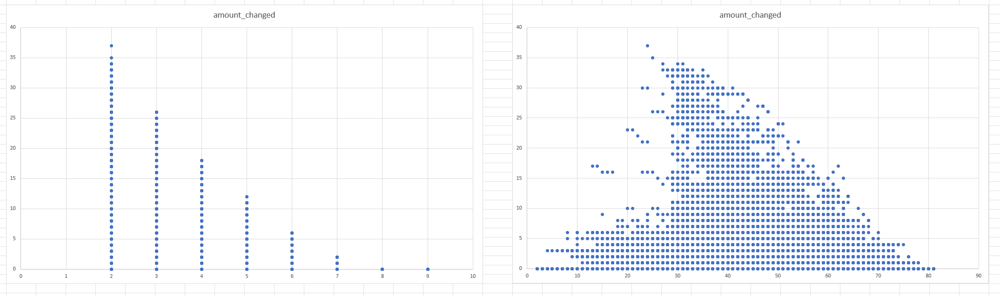

# Mark trial and error

Looking at the above image and other harvested data I have concluded the following for the Mark trail and error solver

- squares that are determined with 2 amount is 70% in-effective
- squares that are determined with 8 and 9 amount statistics are almost 100% never hitting anything
- If determined is less than 25, it is mostly ineffective